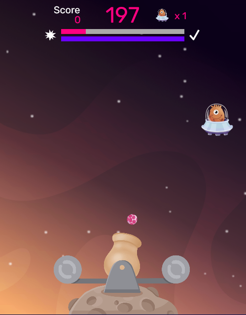

# Cannon ball game

As used in [Sookud, Martin, Gillan & Wise (2024)](https://osf.io/preprints/psyarxiv/zp6vk)

🎮 **Play a demo [here](https://cannon-ball-demo.thewiselab.org/)!**

## Overview

This task is an extension of the "Cannon Blast" game developed by the [Gillan Lab](https://gillanlab.com/), reported in [Donegan et al. (2023)](https://psyarxiv.com/hpm4s/).
The original task represents a gamified version of the ["two-step" task](http://www.sciencedirect.com/science/article/pii/S0896627311001255) and assesses the extent to which individuals use model-based or model-free decision-making strategies.



This task works similarly, but instead of giving participants the task structure (in this case, the colour of the balls fired by the cannon) and asking them to learn the likelihood of the balls being good or bad (i.e., exploding before hitting the target), we provide participants with the likelihood of the balls being good or bad and ask them to learn the task structure (i.e., the colour of the balls fired by the cannon). This allows us to assess how participants learn the task structure, rather than the reward probabilities.

The code here is designed to allow the task to be run in three different configurations:

| Task Configuration        | Description                                                                                           |
|---------------------------|-------------------------------------------------------------------------------------------------------|
| Transition learning task | Assesses task structure learning. Participants are provided with the likelihood of good or bad balls and asked to learn the task structure (color of balls fired by the cannon). |
| Two-step task             | Assesses the use of model-free versus model-based decision-making. Participants are given the task structure and asked to learn the likelihood of balls being good or bad. |
| Model-free learning task  | Assesses reward probability learning without the requirement for task structure learning. There is no structure to be learnt, and participants must simply learn the probability of good or bad balls.

## Running the task

### Task configuration

The task can be run in three different configurations, as described above. The task configuration can be set through the `TASK` URL parameter. The task configuration can be set to one of the following values:

| Task Configuration                 | URL parameter value |
|------------------------------------|---------------------|
| Transition learning task (default) | `MB`                |
| Two-step task                      | `MBMF`              |
| Model-free learning task           | `MF`                |

If the `TASK` URL variable is not set, the task will default to the transition learning task.

The different configurations change the task format as follows:

| Task Configuration | Explosion probabilities | Ball colours | Ball colour probabilities | Confidence trials |
|--------------------|-------------------------|--------------|---------------------------|-------------------|
| Transition learning task | Shown | Pink/Purple | Not shown | ✅ |
| Two-step task | Not shown | Pink/Purple | Shown | ❌ |
| Model-free learning task | Not shown | Grey| N/A | ❌ |

> [!NOTE]
> The model-free learning task is not yet fully implemented.

### Modifying task outcomes

Trial outcomes (i.e., transitions, rewards) are specified in JSON files located in the `src/trial_info` directory. These can be modified as necessary to change the format of the task. The task will automatically detect the number of trials in each file and will loop through them as necessary.

File names for the different task configurations should be:

| Task Configuration | File name |
|--------------------|-----------|
| Transition learning task | `trial_info_transition-learning.json` |
| Two-step task | `trial_info_two-step.json` |
| Model-free learning task (not yet implemented) | `trial_info_model-free.json` |

### URL parameters

Some useful task settings can be specified through URL parameters. These are listed below:

| Parameter | Description | Default value |
|-----------|-------------|---------------|
| `PROLIFIC_PID` | Prolific ID (or any subject ID) | Generates a random integer |
| `TASK` | Task configuration | `MB` |
| `SHORT` | Short version of the task (5 trials) | `false` |
| `TEST` | Test version of the task - skips instructions | `false` |
| `STUDY` | Study identifier - can be useful for saving data to databases | `NONE` |

### Data saving

> [!IMPORTANT]
> For this example repository, data saving is turned off and the code will need to modified slightly (detailed below) to save data to your own database.

#### Google Firebase

The implementation here is designed to use [Google Firebase](https://firebase.google.com/) to store data, but the code can be modified to use other data storage solutions.

If using Firebase, the code expects to find a set of collections and documents as follows:

```
cannonball (collection)
└── game.config.studyID (document)
    └── subjects (collection)
```

The `subjects` collection will then be populated with a document for each participant. Firebase rules will need to be set up appropriately - see [this blog post](https://tobywise.com/posts/firebase-for-online-testing/) for more information on how I typically set up firebase.

The Firebase configuration (e.g., API keys etc.) are stored in `src/firebaseConfig.js`. The version included here is for demonstration purposes only and contains no actual information.

The actual data saving code in `src/data.js` is commented out for this example repository, but can be uncommented and modified as necessary to save data to your own database.

##### Signing in and starting the game

The `index.js` file contains a couple of other functions that are used for Firebase which are currently commented out.

The game is started through:

```javascript
signInAndGetUid()
    .then((uid) => {
        console.log("Signed in with UID:", uid);
        startGame(uid); // Pass uid as an argument to startGame
    })
    .catch((error) => {
        console.error("Sign-in failed:", error);
    });
```

This signs the user in anonymously and then starts the game. The `uid` is passed to the `startGame` function, which is used to save data to the database.

In this example repository, this is commented out, and instead the game is simply started without initialising Firebase. This is useful for testing the game locally. This will need to be reinstated to use Firebase.

The database object `db` is then passed to the game object within the `startGame()` function, which is used to save data to the database:

```javascript
var startGame = function (uid) {
    ...
    game.config.db = db;
    ...
}
```

Again, this is currently commented out and will need to be reinstated to use Firebase.

#### Other data storage solutions

The code can be modified to use other data storage solutions. Functions for storing data are defined in `src/data.js`, and are called within the main game code. This means that these functions can be modified as necessary to change how data is stored, without needing the change the game code itself.

There are two functions defined in `src/data.js` which will need to be modified:

1. `initSubject`

This initialises a subject within the database, which is normally necessary before any data for the subject can be written.

This function takes the `game` object as an argument, which contains a few useful properties:

- `game.registry.get("subjectID")` - the subject ID
- `game.registry.get("task")` - the task configuration (e.g., `MB`, `MFMB`, `MF`)

2. `saveData`

This stores the trial data for a given subject. This function takes the `game` object as an argument, which contains the properties listed above, as well as the following:

- `game.registry.get("data")` - data for all trials so far, as an array of objects

Normally the `saveData` function will save all data collected so far. This is a little inefficient, but ensures that we do not lose any data if one attempt to save fails.

As long as these two function are implemented, the rest of the code should work as expected.
